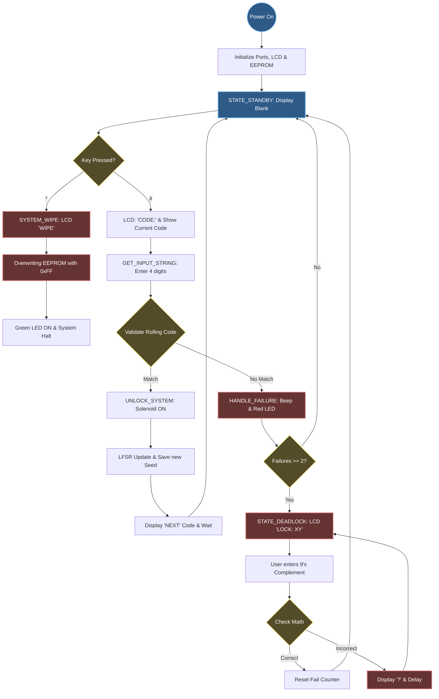

# 🔐 AVR Rolling Code Lock - Advanced Assembly Security System

A professional-grade, low-level security system implemented in **AVR Assembly** for the **ATmega328P**. This project features a **Rolling Code algorithm (LFSR + entropy randomization)**, a **9's Complement Recovery system**, and a **Hardware-Triggered Factory Reset**.

## 📊 System Logic Flow

The updated flowchart now includes the System Wipe logic triggered by the `*` key.

## ✨ Key Features
* **Rolling Code Logic:** Uses a 16-bit LFSR to generate a unique 4-digit code after every successful entry.
* **System Wipe (Factory Reset):** Pressing the `*` key clears the stored seed in EEPROM, resetting the system to its default state on the next boot.
* **Entropy Injection:** Samples hardware timer `TCNT0` during user interaction to ensure pseudo-random unpredictability.
* **EEPROM Persistence:** Saves the security state even after power loss.
* **9's Complement Deadlock:** A secure challenge-response system to prevent brute-force attacks.

## 🛠️ Hardware Specification
| Peripheral | Port/Pin | Function |
| :--- | :--- | :--- |
| **MCU** | ATmega328P | Main Controller (Clock: 16MHz) |
| **LCD Data** | PD4 - PD7 | 4-Bit Data Bus |
| **Keypad Rows** | PB0 - PB3 | Row Scanning (Outputs) |
| **Keypad Cols** | PC0 - PC2 | Column Detection (Inputs) |
| **Solenoid** | PC5 | Lock Actuator |
| **Buzzer** | PD2 | Audio Feedback |
| **Error LED** | PC4 | Visual Alarm Indicator |

## 🕹️ Operation Guide

### **1. Standard Entry**
* Press `#` to begin. Enter the 4-digit passcode.
* **Success:** Solenoid triggers and the next code is generated and shown in the screen for 1-2 seconds.

### **2. Deadlock Recovery**
* If locked out (`LOCK: XY`), calculate the **9's Complement** of both digits displayed in the screen and then press '#'(e.g., if `27`, enter `72#`).These two digits also generated based on time randomization.

### **3. System Wipe (Factory Reset)**
* Press `*` while in Standby. 
* The LCD will display **"WIPE"**, the EEPROM will be cleared, and the Green LED will stay on.
* **Note:** You must power-cycle the device after a wipe to restart with the default seed (`1234`).

