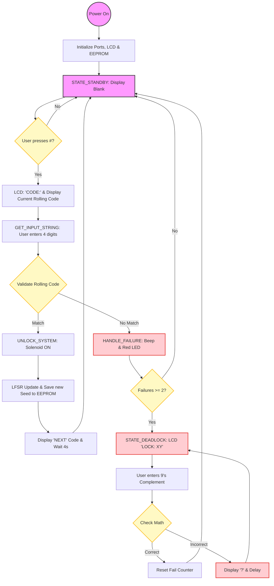

# 🔐 AVR Rolling Code Lock - Advanced Assembly Security System

A professional-grade, low-level security system implemented in **AVR Assembly** for the **ATmega328P**. This project moves beyond static passwords by implementing a **Rolling Code algorithm (LFSR)** and a **9's Complement Recovery system**, making it resistant to replay attacks and brute-force attempts.

## 📊 System Logic Flow

This flowchart illustrates the internal state machine of the firmware, from initialization to the secure deadlock recovery.

## ✨ Key Features
* **Rolling Code Logic:** Uses a 16-bit Linear Feedback Shift Register (LFSR) to generate a unique 4-digit code after every successful entry.
* **Entropy Injection:** Samples hardware timer `TCNT0` during user interaction to ensure the pseudo-random sequence remains unpredictable.
* **EEPROM Persistence:** The seed is saved to non-volatile memory; the lock maintains its security state even after power loss.
* **9's Complement Deadlock:** A math-based challenge-response system that locks out brute-force attempts while providing a secure "backdoor" for authorized users.
* **Optimized LCD Driver:** Direct register manipulation to drive a 16x2 LCD in 4-bit mode using custom assembly timing.

## 🛠️ Hardware Specification
| Peripheral | Port/Pin | Function |
| :--- | :--- | :--- |
| **MCU** | ATmega328P | Main Controller (16MHz) |
| **LCD RS** | PB4 | Register Select |
| **LCD Enable** | PB5 | Data Latch (High-to-Low) |
| **LCD Data** | PD4 - PD7 | 4-Bit Data Bus |
| **Keypad Rows** | PB0 - PB3 | Row Scanning (Output) |
| **Keypad Cols** | PC0 - PC2 | Column Detection (Input w/ Pull-up) |
| **Solenoid** | PC5 | Lock Actuator |
| **Buzzer** | PD2 | Audio Feedback (PWM-simulated) |
| **Error LED** | PC4 | Visual Alarm |

## 🕹️ Operation Guide

### **1. Standard Entry**
1. Press `#` to wake the system.
2. The LCD displays the current valid code.
3. Enter the 4 digits and press `#`.
4. **Success:** Solenoid triggers, and a "NEXT" code is displayed for future use.

### **2. Deadlock Recovery**
If an incorrect code is entered twice, the system locks.
1. The LCD displays `LOCK: XY` (where X and Y are random digits).
2. Calculate: `(9 - X)` and `(9 - Y)`.
3. Enter the two results followed by `#`.
4. **Example:** If screen shows `LOCK: 27`, enter `72#` to unlock the keypad.

## 📂 Project Structure
* `src/main.S`: The core Assembly source code.
* `bin/firmware.hex`: Compiled binary for hardware/Proteus.
* `sim/circuit.pdsprj`: Proteus simulation file.

---
## 📜 License
MIT License - Open for educational and hobbyist use.

---
